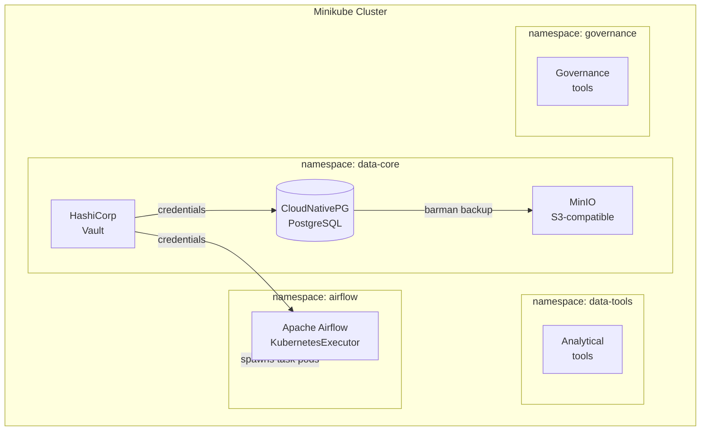
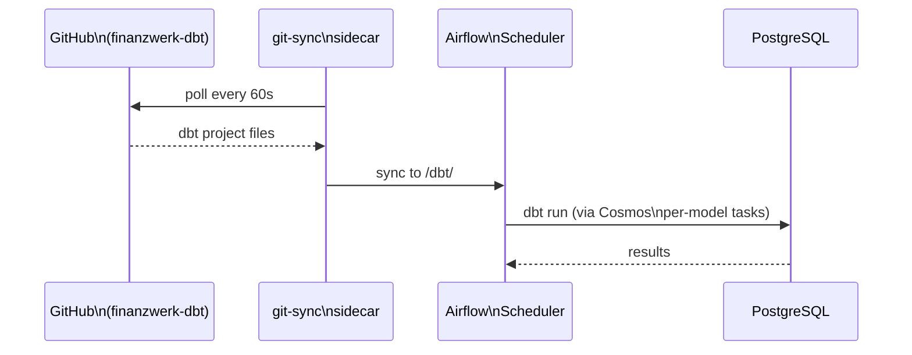
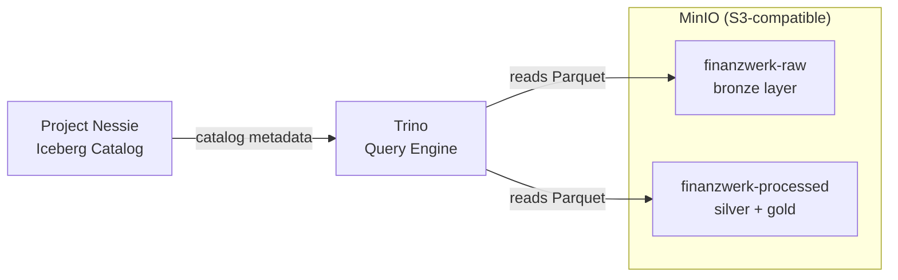
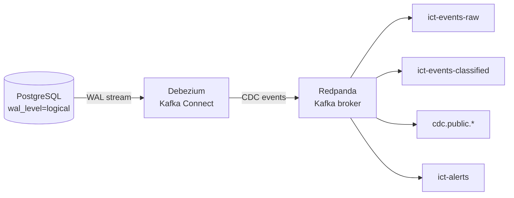
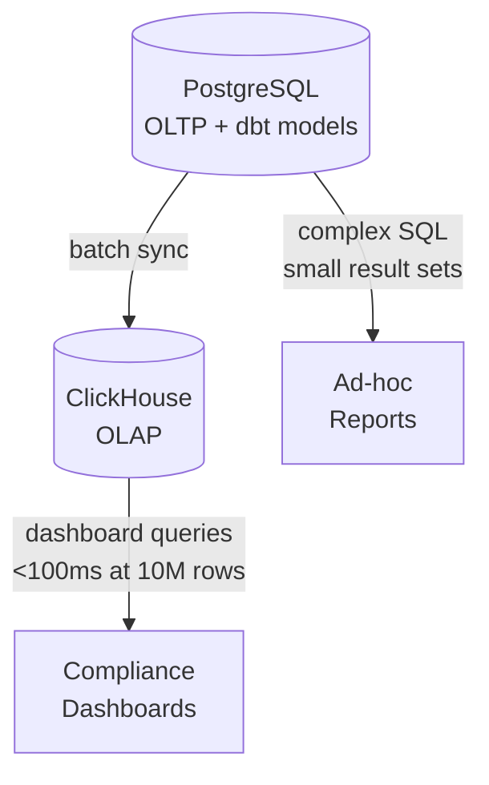
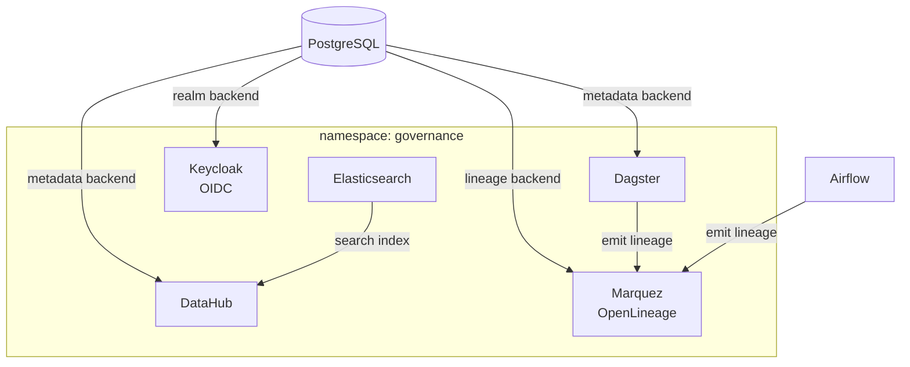
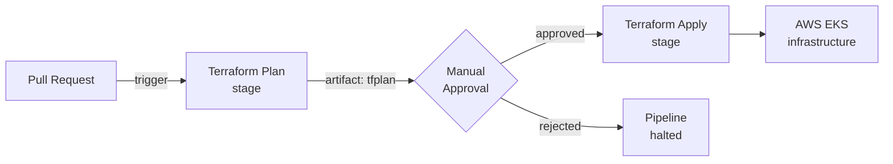

# finanzwerk-infra

> Terraform-managed infrastructure for the FinanzWerk data platform — local Minikube and AWS cloud targets.

All infrastructure is defined as code. `local/` targets Minikube for development; `cloud/` targets AWS EKS. Every service in the stack — PostgreSQL, Airflow, Redpanda, ClickHouse, Dagster, DataHub — is provisioned here and nowhere else.

## Projects in this repo

| # | Project | Stack | Doc |
|---|---------|-------|-----|
| 1 | Local Platform — Minikube, MinIO, PostgreSQL, Vault | Terraform · Kubernetes · Helm | [→](docs/project-01-local-platform.md) |
| 13 | dbt at Depth — Airflow git-sync + Cosmos | Airflow · dbt · Kubernetes | [→](docs/project-13-airflow-dbt-infra.md) |
| 15 | Delta Lake Lakehouse Infrastructure | MinIO · Nessie · Trino | [→](docs/project-15-lakehouse-infra.md) |
| 19 | Streaming Infrastructure — Redpanda + Debezium | Redpanda · Kafka Connect · Kubernetes | [→](docs/project-19-streaming-infra.md) |
| 24 | ClickHouse OLAP Deployment | ClickHouse · Helm | [→](docs/project-24-clickhouse-infra.md) |
| 27 | Keycloak IAM | Keycloak · OIDC · Kubernetes | [→](docs/project-27-keycloak.md) |
| 30 | Governance Infrastructure — Dagster, DataHub, Marquez | Dagster · DataHub · Marquez · Keycloak | [→](docs/project-30-governance-infra.md) |
| 34 | Azure DevOps CI/CD Pipelines | Azure DevOps · Terraform | [→](docs/project-34-azure-devops.md) |

---

---

## Projects

### Project 1: Local Platform — Minikube, MinIO, PostgreSQL, Vault

The foundation: a single `terraform apply` provisions the entire local data platform on Minikube. PostgreSQL runs via CloudNativePG with automated barman backups to MinIO. Vault manages all credentials — no secrets in Terraform state.

[→ `local/`](local/)

---

### Project 13: dbt at Depth — Airflow + dbt Infrastructure

Added git-sync sidecar to the Airflow Helm release, syncing the `finanzwerk-dbt` repo into the scheduler pod. Astronomer Cosmos maps each dbt model to an individual Airflow task, giving per-model failure visibility in the UI.

[→ `local/airflow.tf`](local/airflow.tf)

---

### Project 15: Delta Lake Lakehouse Infrastructure

Provisioned MinIO buckets for the medallion lakehouse (`finanzwerk-raw`, `finanzwerk-processed`), deployed Project Nessie as the Iceberg catalog, and deployed Trino as the query engine over the lakehouse.

[→ `local/`](local/)

---

### Project 19: Streaming Infrastructure — Redpanda + Debezium

Deployed Redpanda (Kafka-compatible, no ZooKeeper) in the `data-tools` namespace. Created Debezium Kafka Connect deployment and enabled PostgreSQL logical replication (`wal_level=logical`) on the CloudNativePG cluster for CDC.

[→ `local/redpanda.tf`](local/redpanda.tf) · [→ `local/debezium.tf`](local/debezium.tf)

---

### Project 24: ClickHouse OLAP Deployment

Deployed ClickHouse in the `data-tools` namespace. At 10M rows ClickHouse returns the quarterly DORA report 40× faster than PostgreSQL — columnar storage and vectorised execution trading write throughput for read speed.

[→ `local/`](local/)

---

### Project 30: Governance Infrastructure

Provisioned the entire governance namespace: Dagster (asset orchestration), DataHub (data catalog), Marquez (OpenLineage backend), Keycloak (OIDC identity provider), and Elasticsearch (DataHub dependency). Six Helm releases, all wired to the shared PostgreSQL and Redpanda instances.

[→ `local/dagster.tf`](local/dagster.tf) · [→ `local/datahub.tf`](local/datahub.tf) · [→ `local/marquez.tf`](local/marquez.tf)

---

### Project 34: Azure DevOps CI/CD Pipelines

YAML pipeline: Terraform plan outputs an immutable plan artifact, the Apply stage uses a `deployment` job type targeting the `production` environment — requiring manual approval before any infra change reaches production. Satisfies DORA Article 9 change management requirements.

[→ `azure-pipelines.yml`](azure-pipelines.yml)
