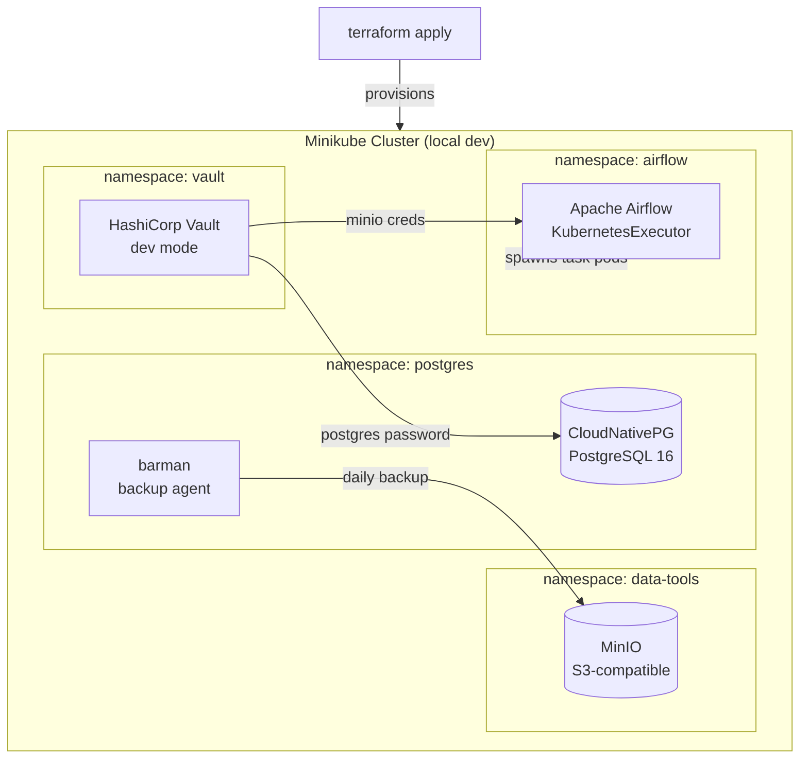

# Project 1: Local Platform — Minikube, MinIO, PostgreSQL, Vault

> One `terraform apply` spins up the entire local data platform on Minikube. PostgreSQL, MinIO (S3-compatible object storage), and Vault all running in Kubernetes with no manual steps.

Started here because everything else in the project depends on a running database and somewhere to put files. The goal was to make it fully reproducible — if you nuke the cluster and run `terraform apply` again you get the exact same setup. No clicking around in UIs, no ad-hoc `kubectl apply` commands floating around.

Vault is handling secrets instead of Kubernetes Secrets because k8s Secrets are just base64-encoded (not actually encrypted). Vault gives you proper encryption, versioning, and an audit log. DORA Art. 9 requires documented access controls on ICT systems, so having an audit trail for secret access matters.

## Architecture

CloudNativePG is doing the heavy lifting for Postgres — it handles failover and the backup integration with barman/MinIO automatically. Using MinIO locally means the pipeline code uses the same boto3/S3 API as AWS, so nothing changes when deploying to cloud.

## Code

| Path | Description |
|------|-------------|
| [`local/postgresql.tf`](../local/postgresql.tf) | CloudNativePG cluster, roles, backup config |
| [`local/minio.tf`](../local/minio.tf) | MinIO Helm release, bucket creation Job |
| [`local/vault.tf`](../local/vault.tf) | Vault Helm release, KV secrets engine |
| [`local/namespaces.tf`](../local/namespaces.tf) | All K8s namespace definitions |
| [`local/variables.tf`](../local/variables.tf) | All configurable parameters |
