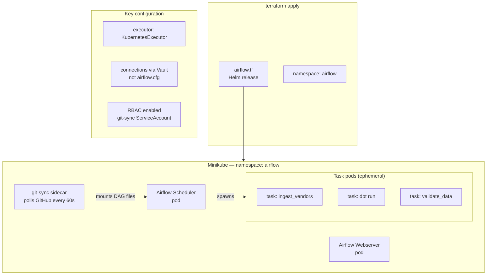

# Project 13: dbt and Airflow Infrastructure

> Airflow deployed to Minikube with KubernetesExecutor. DAG files stay in sync with git via a sidecar container. dbt runs in isolated task pods, not inside the scheduler.

The KubernetesExecutor means each Airflow task spawns its own pod. It's more setup than the LocalExecutor but you get proper resource isolation — a memory-hungry Spark submission doesn't kill the scheduler. Dead task pods clean themselves up.

## Deployment architecture

The git-sync sidecar is how DAG deployments work — it watches the GitHub repo and updates the local DAG directory every 60 seconds. You merge a PR and it's live within a minute. No image rebuilds, no rolling restarts.

dbt's `manifest.json` gets written to MinIO after each run and downloaded at the start of the next one. That's what enables `--select state:modified+` to work — dbt compares the current model SQL against the previous manifest to figure out what changed.

## Code

| Path | Description |
|------|-------------|
| [`local/airflow.tf`](../local/airflow.tf) | Airflow Helm release, git-sync config |
