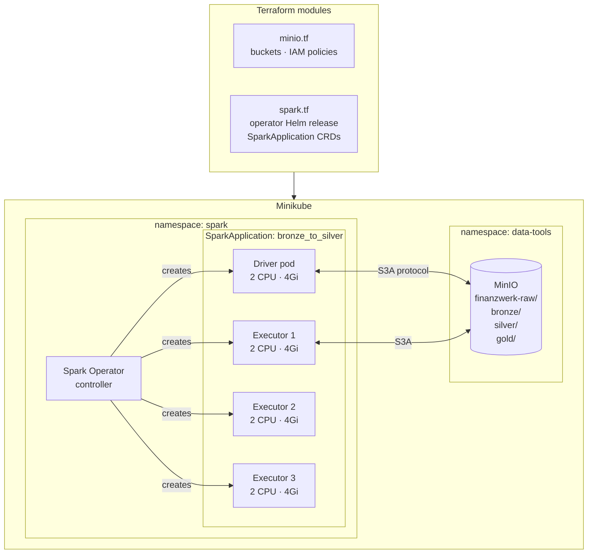

# Project 15: Lakehouse Infrastructure — Spark Operator and MinIO

> Kubernetes Spark Operator deployed via Terraform so Spark jobs can be submitted as Kubernetes resources. MinIO gets the bucket structure for the three medallion layers. No `spark-submit` scripts.

The Spark Operator replaces `spark-submit` with Kubernetes custom resources. Instead of running a shell command, you define a `SparkApplication` YAML and `kubectl apply` it. That means GitOps works for Spark jobs — the job definition is in source control, not a script someone runs manually.

## Infrastructure components

The bucket layout matches the medallion layers: `bronze/` for raw landing, `silver/` for cleaned and schema-enforced data, `gold/` for aggregated business-ready data. The S3A protocol means Spark talks to MinIO the same way it would talk to AWS S3 — same configuration, just different endpoint URL.

## Code

| Path | Description |
|------|-------------|
| [`local/spark.tf`](../local/spark.tf) | Spark Operator Helm + RBAC |
| [`local/minio.tf`](../local/minio.tf) | Bucket provisioning + bucket policies |
