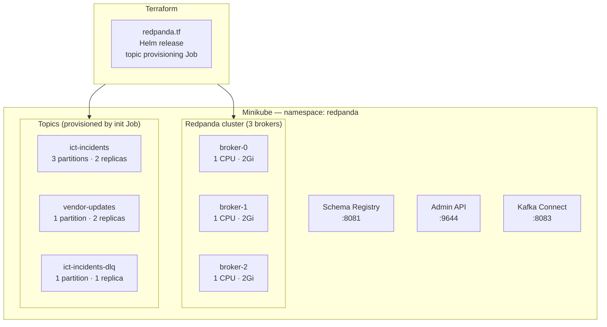

# Project 19: Streaming Infrastructure — Redpanda on Minikube

> Redpanda (Kafka-compatible, no JVM) deployed to Minikube via Terraform. Topics created as part of the Terraform apply. Same Kafka client libraries work unchanged.

Picked Redpanda over Kafka for local dev because it doesn't need a JVM or ZooKeeper — it's a single binary that starts in a couple of seconds. The API is 100% Kafka-compatible so all the Python producer/consumer code works without any changes if you switch to a real Kafka cluster.

## Cluster topology

3 partitions on `ict-incidents` so up to 3 consumer instances can process in parallel. There are three separate consumer groups reading from this topic (bronze, classification, notification) — each gets all messages independently.

## Code

| Path | Description |
|------|-------------|
| [`local/redpanda.tf`](../local/redpanda.tf) | Redpanda Helm + topic init Job |
| [`local/kafka_connect.tf`](../local/kafka_connect.tf) | Kafka Connect for Debezium |
