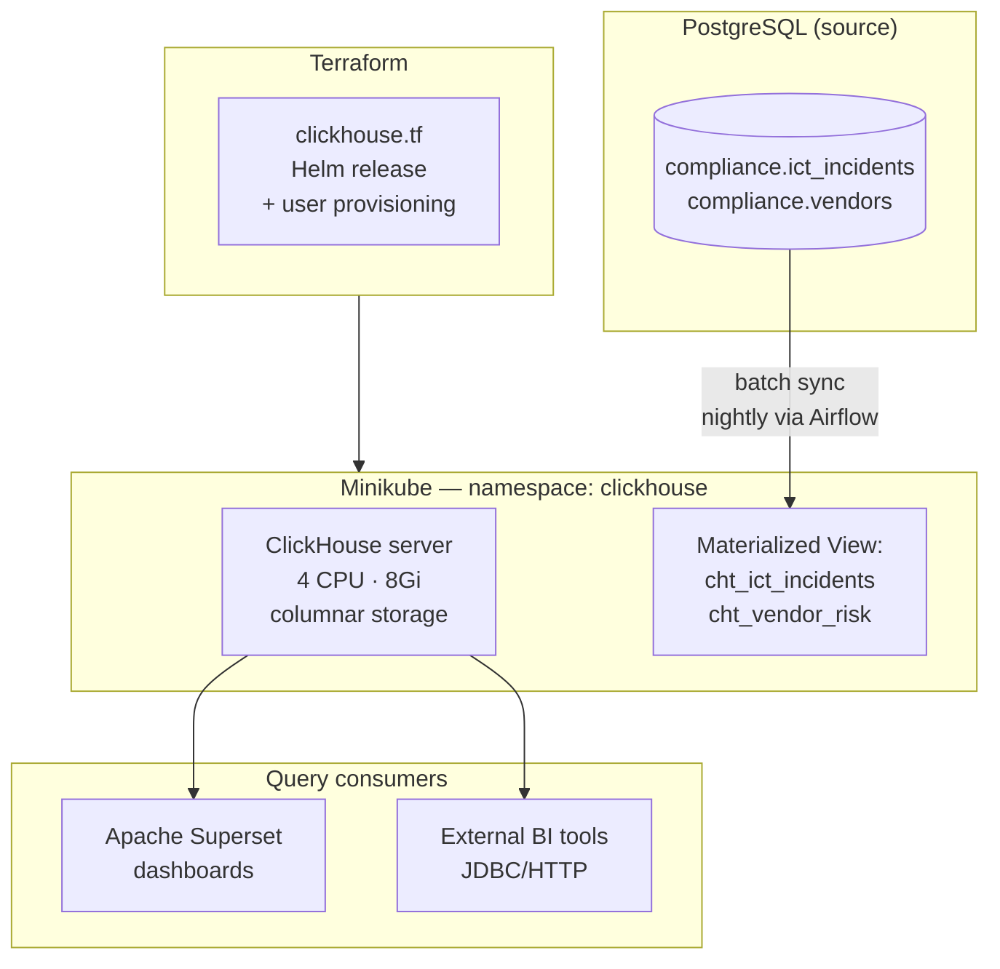

# Project 24: ClickHouse Infrastructure

> ClickHouse deployed to Minikube for OLAP (analytical) queries. Data syncs nightly from PostgreSQL. For aggregation queries over millions of rows, it's 100x faster than PostgreSQL.

PostgreSQL is great for the operational stuff — writes, point lookups, joins with foreign key checks. But it's a row-oriented database, which means scanning all 10M incidents to count by severity is slow. ClickHouse stores data by column instead of by row, which makes full-table aggregations extremely fast.

## Deployment topology

## ClickHouse vs PostgreSQL — when to use which

| Query type | PostgreSQL | ClickHouse |
|-----------|-----------|-----------|
| Write single incident | ✓ fast | ✗ not designed for it |
| Lookup by `incident_id` | ✓ index scan | ✗ full column scan |
| COUNT(*) over 10M rows | ~8 seconds | ~0.02 seconds |
| GROUP BY quarter + severity | ~3 seconds | ~0.01 seconds |

The nightly sync means ClickHouse is always a few hours behind PostgreSQL. That's fine for reporting — nobody needs the compliance dashboard to update in real-time.

## Code

| Path | Description |
|------|-------------|
| [`local/clickhouse.tf`](../local/clickhouse.tf) | ClickHouse Helm + user config |
| [`local/superset.tf`](../local/superset.tf) | Apache Superset Helm (BI frontend) |
