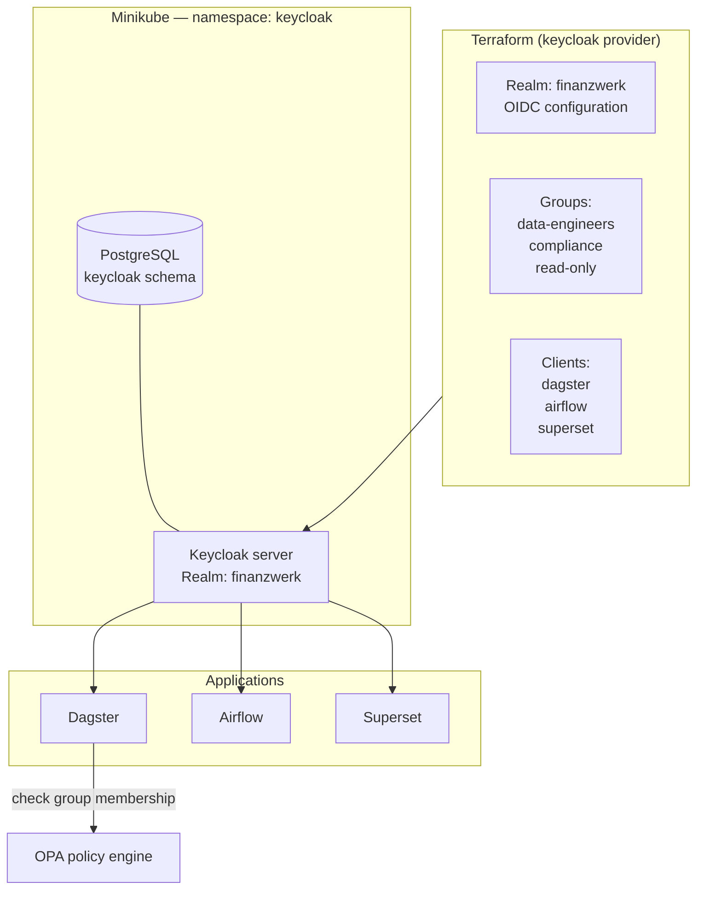

# Project 27: Keycloak IAM Infrastructure

> Keycloak deployed to Minikube as the central identity provider. Realm, groups, and OAuth clients all managed through Terraform — no manual clicking in the Keycloak admin UI.

The problem with clicking through the Keycloak UI is that you can't reproduce it. If the cluster dies, you have to remember what you configured. With the Terraform Keycloak provider, destroying and recreating the cluster restores the exact same auth setup. It's also reviewable — you can see in git exactly what changed and when.

## Identity provider architecture

Three groups map to what each person can do:

| Keycloak group | PostgreSQL role | Can do |
|---------------|----------------|--------|
| `data-engineers` | `readwrite` | Run any pipeline, materialize any asset |
| `compliance` | `readonly` | Read compliance assets, can't modify |
| `read-only` | `readonly` | Browse lineage and catalogue, nothing else |

## Code

| Path | Description |
|------|-------------|
| [`local/keycloak.tf`](../local/keycloak.tf) | Keycloak Helm + realm + groups |
| [`local/opa.tf`](../local/opa.tf) | Open Policy Agent deployment |
