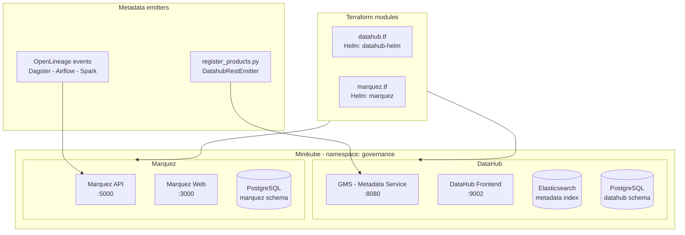

# Project 30: Data Governance Infrastructure — DataHub and Marquez

> Two governance tools running on Minikube: DataHub for the data catalogue, Marquez for lineage tracking. Both deployed via Terraform so they come up automatically with the rest of the platform.

DataHub answers "what is this dataset and who owns it". Marquez answers "where did this data come from and what touched it". They're not competing tools — they do different things. DataHub is more for business users and data owners. Marquez is more for engineers debugging a broken pipeline.

## Platform topology

## Why run both

DataHub needs Elasticsearch under the hood, which makes it heavier to run locally. But it's the tool people actually use to browse and search the catalogue. Marquez is much lighter (just a REST API + Postgres) and handles the raw lineage data that OpenLineage emitters push to it.

In prod you'd probably hook DataHub up to Marquez as a lineage source too, but for local dev keeping them separate is fine.

## Code

| Path | Description |
|------|-------------|
| [`local/datahub.tf`](../local/datahub.tf) | DataHub Helm + Elasticsearch + Kafka |
| [`local/marquez.tf`](../local/marquez.tf) | Marquez Helm + PostgreSQL backend |
