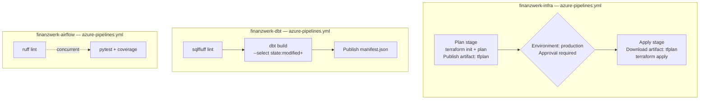

# Project 34: Azure DevOps CI/CD

> Azure Pipelines for the three main repos. The infra pipeline has a mandatory human approval gate between plan and apply. The dbt pipeline only runs models that actually changed. Airflow has parallel lint and test stages.

The infra pipeline is the most important one to get right. In a regulated environment, a `terraform apply` without any approval process is a governance finding. The approval gate is enforced by the pipeline definition using a `deployment` job — it's not just convention, it can't be bypassed without changing the YAML.

## Pipeline overview

The terraform approval works because `deployment` jobs in Azure Pipelines can be gated on an `environment` resource. The tfplan artifact is published before the gate — whoever approves sees exactly what will be applied. After approval, that same plan file is downloaded and applied. The plan can't drift between review and execution.

## Code

| Path | Description |
|------|-------------|
| [`azure-pipelines.yml`](../azure-pipelines.yml) | Infra Plan + gated Apply |
| [`docs/cicd_comparison.md`](../docs/cicd_comparison.md) | GitHub Actions vs Azure DevOps comparison |
| [`azure-pipelines.yml`](../../finanzwerk-dbt/azure-pipelines.yml) | dbt lint + state-aware build |
| [`azure-pipelines.yml`](../../finanzwerk-airflow/azure-pipelines.yml) | Parallel lint + pytest |
